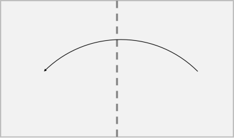
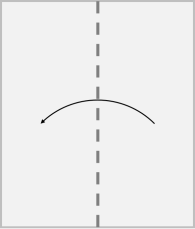
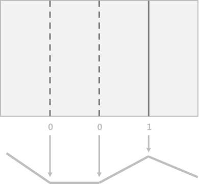

# Algorithm Study #15

## Problem title: **Origami**

## Problem description

직사각형 종이를 n번 접으려고 합니다. 이때, 항상 오른쪽 절반을 왼쪽으로 접어 나갑니다. 다음은 n = 2인 경우의 예시입니다.



먼저 오른쪽 절반을 왼쪽으로 접습니다.



다시 오른쪽 절반을 왼쪽으로 접습니다.


종이를 모두 접은 후에는 종이를 전부 펼칩니다. 종이를 펼칠 때는 종이를 접은 방법의 역순으로 펼쳐서 처음 놓여있던 때와 같은 상태가 되도록 합니다. 위와 같이 두 번 접은 후 종이를 펼치면 아래 그림과 같이 종이에 접은 흔적이 생기게 됩니다.



위 그림에서 ∨ 모양이 생긴 부분은 점선(0)으로, ∧ 모양이 생긴 부분은 실선(1)으로 표시했습니다.

종이를 접은 횟수 n이 매개변수로 주어질 때, 종이를 절반씩 n번 접은 후 모두 펼쳤을 때 생기는 접힌 부분의 모양을 배열에 담아 return 하도록 solution 함수를 완성해주세요.

**Limitation**
- 종이를 접는 횟수 n은 1 이상 20 이하의 자연수입니다.
- 종이를 접었다 편 후 생긴 굴곡이 ∨ 모양이면 0, ∧ 모양이면 1로 나타냅니다.
- 가장 왼쪽의 굴곡 모양부터 순서대로 배열에 담아 return 해주세요.

***

## Problem solving process

종이를 몇 번 접었느냐에 따라 결과가 어떻게 나오는지부터 확인 해봤습니다.

> n -> 1  
> result -> { 0 }  

> n => 2  
> { 0, 0, 1 }

> n => 3  
> { 0, 0, 1, 0, 0, 1, 1 }  

> n => 4  
> { 0, 0, 1, 0, 0, 1, 1, 0, 0, 0, 1, 1, 0, 1, 0 }

```n```번 접었을 때의 결과는 이전 단계의 결과에서 0과 1을 맨 처음부터 번갈아가며 삽입된 배열입니다.

일단 이전 결과를 먼저 계산하고, ```answer```에 이전 단계의 결과와 0, 1을 번갈아가면서 추가하도록 했습니다.

모두 건너뛰고 반복문으로 넘어가겠습니다.
이전 단계의 결과를 저장하고 있는 ```previousResult```가 있고, 0과 1을 반복하여 집어넣는 코드입니다.
현재 아이디를 2로 나누고 남은 나머지를 ```answer```에 삽입했습니다. 반복문이 0부터 시작하기 때문에 0부터 시작해서 0과 1일 반복해서 ```answer```에 삽입됩니다.
``` cpp
for (int r = 0; r <= previousResult.size(); r++) {
    answer.push_back(r % 2);
    if (r < previousResult.size()) answer.push_back(previousResult[r]);
}
```

완성된 코드입니다.
``` cpp
#include <string>
#include <vector>

using namespace std;

vector<int> solution(int n) {
    vector<int> answer;
    vector<int> previousResult;

    for (int i = 1; i <= n; i++) {
        answer.clear();
        for (int r = 0; r <= previousResult.size(); r++) {
            answer.push_back(r % 2);
            if (r < previousResult.size()) answer.push_back(previousResult[r]);
        }
        previousResult = answer;
    }

    return answer;
}
```